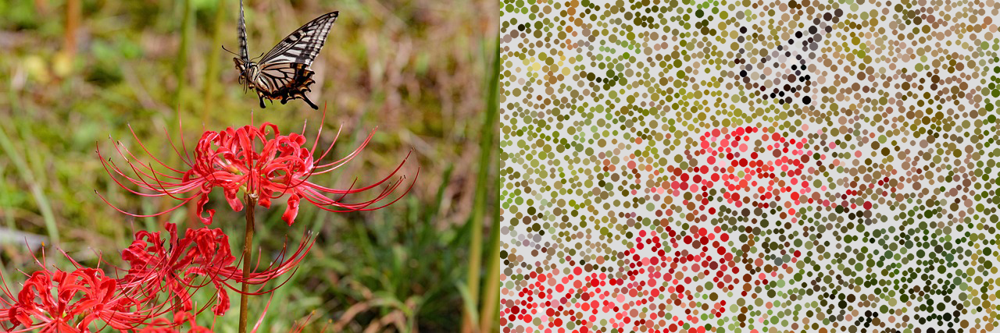
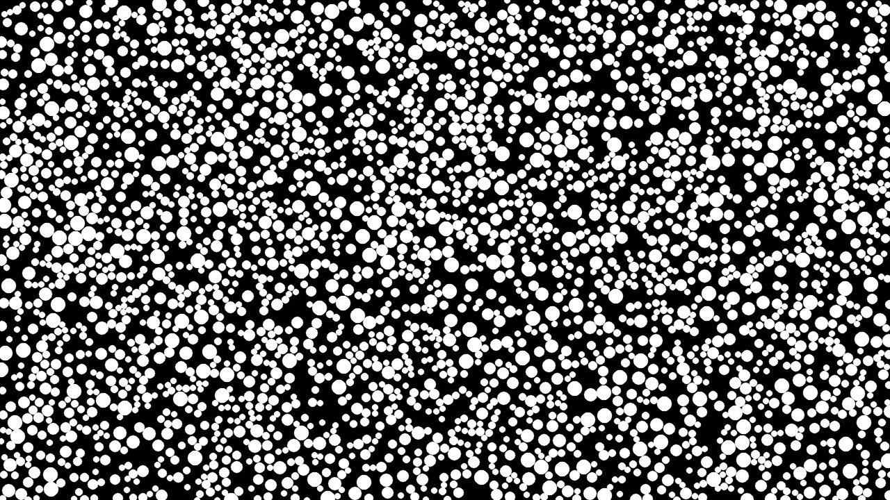

# Noise and Abstract Art in Python

This library is not complete. I add new art or noise functions as I need to. Packing is NOT optimal. Perlin Noise is most likely NOT optimal. If you want them to be optimal and fast, do not use Python. I implemented them to see how they were made and since the information is very scarce with not many implementations in Python, I'm sharing it.

## Flowfield 

https://github.com/mehmetcanakbay/noiseabstractart-python/assets/73856544/1a134528-6434-4893-83d8-654fab9fe0a4

## Random Shape

## Pack Circles Image

## Random Circles

## Pack Image No Image

### Dependencies
OpenCV,
Pygame,
NumPy,
tqdm

#### Copyright Notice of Pack Circle Image example

Image by <a href="https://pixabay.com/users/darkness_s-9359670/?utm_source=link-attribution&utm_medium=referral&utm_campaign=image&utm_content=6656337">darkness_s</a> from <a href="https://pixabay.com//?utm_source=link-attribution&utm_medium=referral&utm_campaign=image&utm_content=6656337">Pixabay</a>
